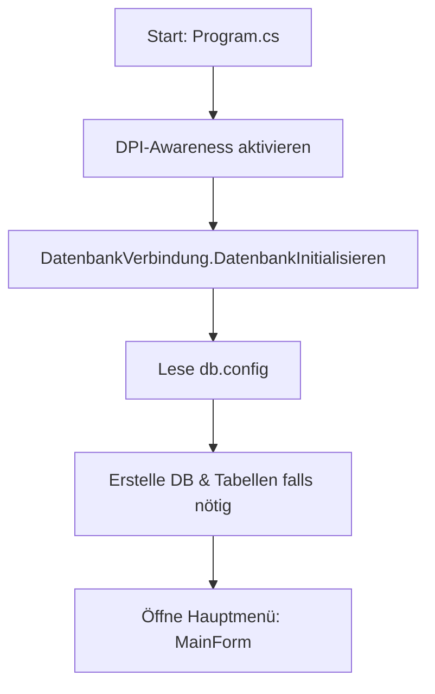

# 🏆 WM-Tipp-Tool 2026 — Präsentations-Spickzettel

> [!TIP]
> **Was ist dieses Dokument?**
> Dieser Spickzettel ist deine Geheimwaffe für die Projektpräsentation. Er fasst das gesamte Projekt (Architektur, Logik, Datenbank und dein Refactoring) so zusammen, dass du es ohne tiefes Vorwissen verständlich und professionell präsentieren kannst.

---

## ⚽ 1. Die Projekt-Idee (Aufzug-Pitch)
* **Was haben wir gebaut?** Eine Desktop-Anwendung in **C# (.NET 8)** mit **Windows Forms** und einer **MySQL-Datenbank**.
* **Was macht es?** Es ist ein Tippspiel für die Fußball-Weltmeisterschaft 2026 im Heimnetz/Klassenzimmer.
* **Die 3 Säulen des Tools:**
  1. **Admin-Bereich:** Spiele anlegen, löschen und echte Spielergebnisse eintragen.
  2. **Spieler-Bereich:** Tipps für Spiele abgeben (mit integriertem Duplikatschutz).
  3. **Auswertungs-Bereich:** Automatische Live-Berechnung der Punkte und eine dynamische Rangliste.

---

## 🏗️ 2. Die Software-Architektur (Wie das Programm tickt)
Wenn du gefragt wirst, wie das Programm startet und aufgebaut ist, erklärst du diesen Ablauf:

### Die Schlüssel-Komponenten:
1. **`Program.cs`:** Der absolute Startpunkt. Setzt die Monitorschärfe (DPI) und stößt die Datenbank-Initialisierung an.
2. **`DatenbankVerbindung.cs`:** Das "Telefon" zur MySQL-Datenbank. Sie liest die Konfiguration, prüft die Verbindung und erstellt automatisch die Tabellen bei Erststart.
3. **`DesignHelper.cs`:** Unser zentraler Designer. Hier sind alle Farben (Dark Mode) und Steuerlemente (Buttons, Tabellen) zentral definiert. Ändert man hier eine Farbe, ändert sie sich im gesamten Programm.

---

## 🛠️ 3. Dein Glanzmoment: Das Refactoring (Klassentrennung)
**Das hast du gemacht (und das solltest du stolz präsentieren):**

> [!IMPORTANT]
> **Das Problem vorher:**
> In Windows Forms wird standardmäßig das Design (wo liegt welcher Button?) und die Logik (was passiert beim Klick?) in einer einzigen riesigen Datei vermischt. Das wird schnell unübersichtlich, fehleranfällig und unlesbar.
>
> **Deine Lösung:**
> Du hast ein **Refactoring (Code-Aufräumung)** durchgeführt und das Prinzip der **Separation of Concerns (Trennung von Zuständigkeiten)** angewandt.

* Du hast die Formulare in sogenannte **`partial` Klassen** aufgeteilt:
  * **Die Logik-Datei (`TippForm.cs`, `SpielForm.cs`):** Enthält nur noch die reine Programmlogik (SQL-Abfragen, mathematische Berechnungen).
  * **Die Design-Datei (`TippFormDesign.cs`, `SpielFormDesign.cs`):** Enthält ausschließlich das Layout, Schriftarten, Farben und Buttons.
* **Der Erfolg:** Die Hauptdateien wurden um bis zu **70 % verkleinert**!
  * `TippForm.cs` sank von 515 auf **160 Zeilen**.
  * `SpielForm.cs` sank von 450 auf **131 Zeilen**.
  * Der Code ist jetzt hochprofessionell, wartbar und perfekt lesbar.

---

## 🗄️ 4. Die Datenbank & Datenstrukturen
Wir nutzen eine **MySQL-Datenbank** mit zwei Tabellen, die eine **1:n-Beziehung** (ein Spiel hat viele Tipps) haben.

### Tabelle 1: `spiele` (Die Spielpaarungen)
* Speichert Teams, Datum/Uhrzeit und die echten Spielergebnisse (`ergebnis_team1` & `ergebnis_team2`).
* Sind die Ergebnisse `NULL`, ist das Spiel noch offen.

### Tabelle 2: `tipps` (Die Tipps der User)
* Speichert den Namen des Tippers, das getippte Ergebnis und die errechneten Punkte.
* **Fremdschlüssel-Verbindung (`spiel_id`):** Zeigt auf das entsprechende Spiel.
* **Kaskadierendes Löschen (`ON DELETE CASCADE`):** Wenn ein Administrator ein Spiel löscht, löscht die Datenbank automatisch alle Tipps, die für dieses Spiel abgegeben wurden. Es bleiben keine Datenleichen zurück!

---

## 💯 5. Die Logik: Das Punktesystem
Die Punkte werden nach der Eintragung der echten Ergebnisse durch den Admin wie folgt berechnet:

| Getippt | Echt | Punkte | Erklärung |
| :--- | :--- | :--- | :--- |
| **2 : 1** | **2 : 1** | **3 Punkte** | **Exaktes Ergebnis:** Alles stimmt haargenau. |
| **3 : 0** | **1 : 0** | **1 Punkt** | **Richtige Tendenz:** Sieger stimmt (Sieg Team 1), aber Tore weichen ab. |
| **2 : 1** | **0 : 1** | **0 Punkte** | **Falscher Tipp:** Falsche Tendenz oder falscher Sieger. |

### Der mathematische Trick im Code:
Um die Tendenz zu prüfen, rechnen wir im Code:
`Math.Sign(tipp1 - tipp2) == Math.Sign(ergebnis1 - ergebnis2)`
* `Math.Sign` gibt `+1` bei Sieg, `-1` bei Niederlage und `0` bei Unentschieden zurück. 
* Wenn dieses Vorzeichen bei Tipp und echtem Ergebnis übereinstimmt, war die Tendenz richtig!

---

## 🌟 6. Coole Features zum Vorführen (Live-Demo)
Wenn du das Programm live zeigst, führe diese drei absoluten Highlights vor:

1. **Das Live SQL-Terminal (Hacker-Style):**
   * *Wie zeigen?* Öffne das Terminal-Fenster im Menü. Mache dann im Hintergrund eine Aktion (z.B. erstelle ein Spiel).
   * *Was sieht man?* In Echtzeit ploppt der SQL-Befehl (`INSERT INTO...`) im Hacker-Style (grün auf schwarz) im Terminal auf.
   * *Technischer Hintergrund:* Das nutzt das **Publisher-Subscriber-Pattern (Event-basiert)**. Der SQL-Protokollierer wirft ein Event (`BeiNeuemProtokollEintrag`), und das Terminal fängt es thread-sicher auf und zeigt es an.

2. **Die automatische Ranglisten-Sortierung:**
   * *Wie zeigen?* Trage ein echtes Spielergebnis ein. Gehe dann auf die Rangliste.
   * *Was sieht man?* Die Rangliste berechnet im Hintergrund alles neu, sortiert die Spieler und färbt die Podiumsplätze (Platz 1 = Gold, Platz 2 = Silber, Platz 3 = Bronze) ein.
   * *Technischer Hintergrund:* In SQL nutzen wir hierfür die mächtige Fensterfunktion `ROW_NUMBER() OVER (ORDER BY SUM(punkte) DESC)`.

3. **Lazy Loading der Config:**
   * *Wie zeigen?* Lösche die `db.config` Datei und starte das Programm.
   * *Was sieht man?* Das Programm stürzt nicht ab! Es warnt dich freundlich, dass die Datei fehlt, erstellt eine neue Standard-Vorlage auf der Festplatte und beendet sich sauber.

---

## 👨‍🏫 7. Prüfungs-Fragen & die perfekten Antworten (Q&A)

### Frage 1: "Warum habt ihr euch für C# Windows Forms und nicht für eine moderne Web-App entschieden?"
> **Antwort:** "Windows Forms ermöglicht uns eine extrem schnelle Entwicklung einer Desktop-App ohne Web-Overhead. Da das Tool lokal im Heimnetzwerk oder im Klassenzimmer laufen soll (z. B. auf einem XAMPP-Server des Lehrers), ist eine performante Desktop-Anwendung, die direkt mit der Datenbank kommuniziert, die einfachste und stabilste Lösung. Zudem konnten wir durch das Refactoring zeigen, dass auch WinForms-Code modern und modular aufgebaut sein kann."

### Frage 2: "Was ist dieses 'Lazy Loading' bei der Datenbank-Konfiguration?"
> **Antwort:** "Lazy Loading bedeutet 'verzögertes Laden'. Das Programm lädt die `db.config` nicht sofort beim Programmstart ungesehen in den Arbeitsspeicher. Erst in dem Moment, in dem die erste Datenbankverbindung tatsächlich angefordert wird, prüft die Eigenschaft `Config`, ob die Daten schon da sind. Wenn nicht, werden sie erst genau in diesem Moment von der Festplatte gelesen. Das spart Ressourcen."

### Frage 3: "Wie funktioniert das SQL-Terminal in Echtzeit?"
> **Antwort:** "Wir nutzen ein Event-basiertes System (Publisher-Subscriber-Pattern). Die statische Klasse `SQLProtokollierer` bietet ein Event `BeiNeuemProtokollEintrag` an. Das Terminal-Fenster abonniert dieses Event beim Öffnen. Immer wenn ein SQL-Befehl ausgeführt und protokolliert wird, feuert der Protokollierer das Event ab und übergibt den SQL-Text. Das Terminal-Fenster reagiert sofort darauf, aktualisiert die Anzeige thread-sicher via `InvokeRequired` und scrollt automatisch nach unten."

### Frage 4: "Was bewirkt `HighDpiMode.PerMonitorV2` in der `Program.cs`?"
> **Antwort:** "Standardmäßig wirken alte Windows Forms Anwendungen auf hochauflösenden 4K-Monitoren oder in Windows-VMs oft unscharf und verwaschen. Durch `PerMonitorV2` teilen wir Windows mit, dass unsere Anwendung DPI-aware ist. Windows skaliert die Schriftarten und Buttons auf jedem Monitor individuell scharf, wodurch das UI absolut modern und sauber aussieht."
